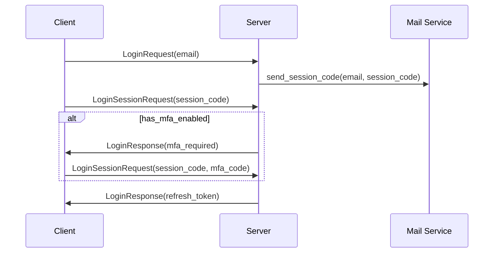
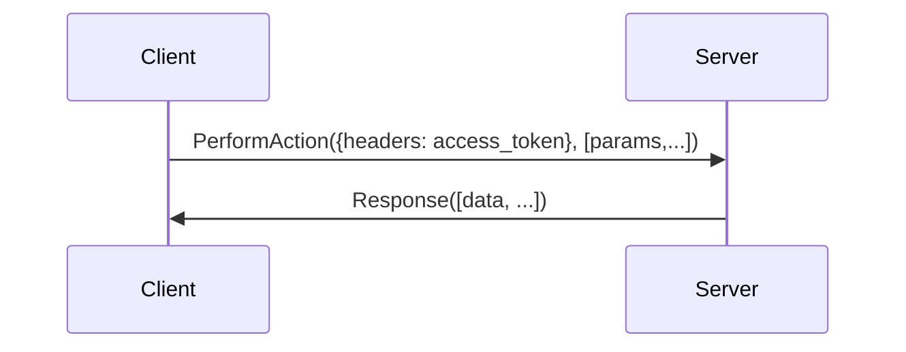

# Obtaining a `refresh_token`

## Happy path

## Error handling
TODO

# Obtaining an `access_token`

## Happy path

## Error handling
TODO

# Making authenticated calls

## Happy path

## Error handling
TODO
