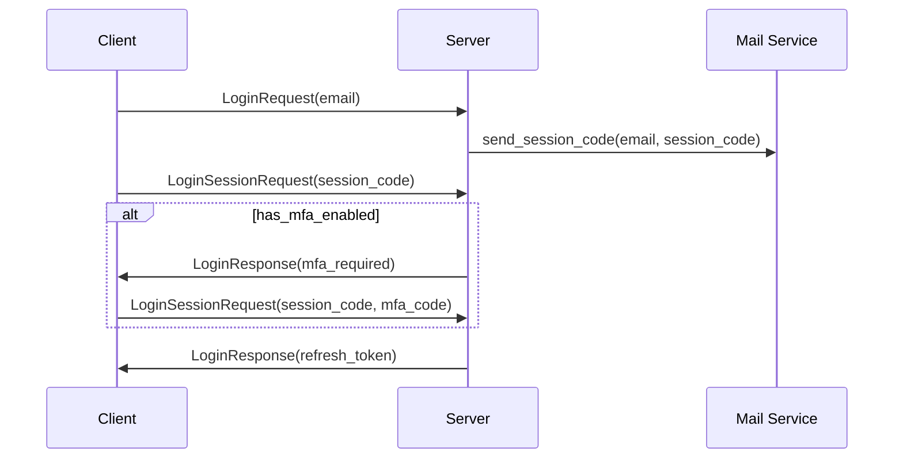
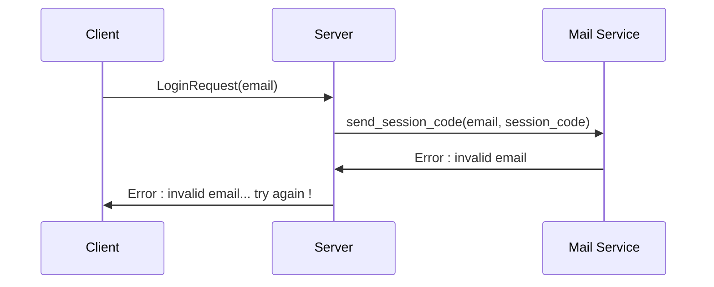
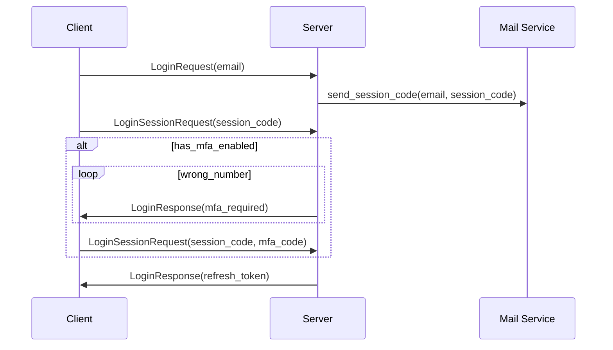
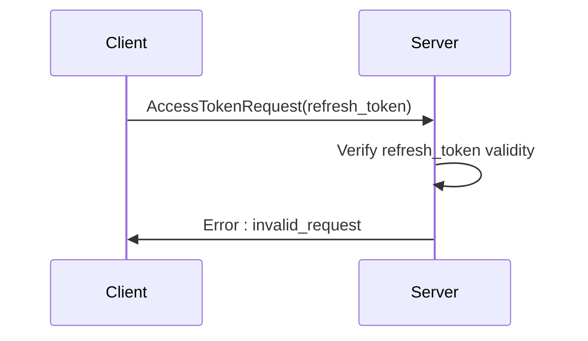
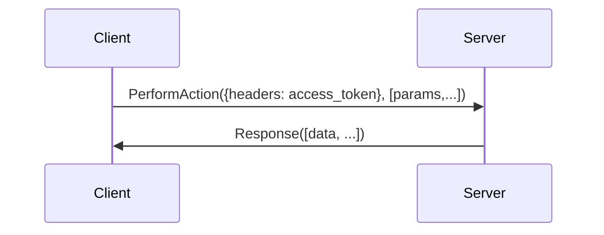
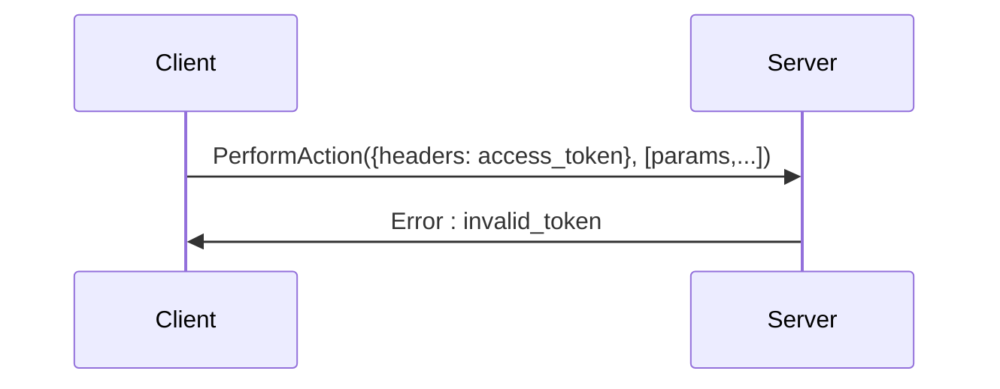
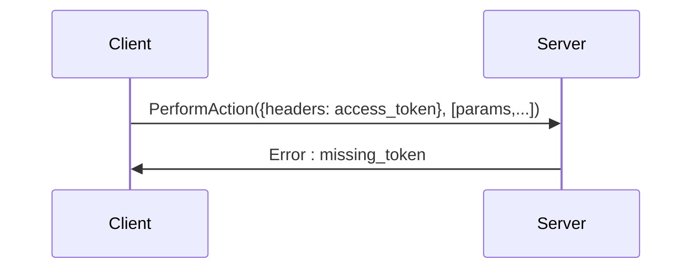

# Obtaining a `refresh_token`

## Happy path

## Error handling

### wrong email

### mfa : wrong phone number

### session_code invalid

# Obtaining an `access_token`

## Happy path

## Error handling

### invalid token

### missing token

# Making authenticated calls

## Happy path

## Error handling

### invalid token

### missing token

