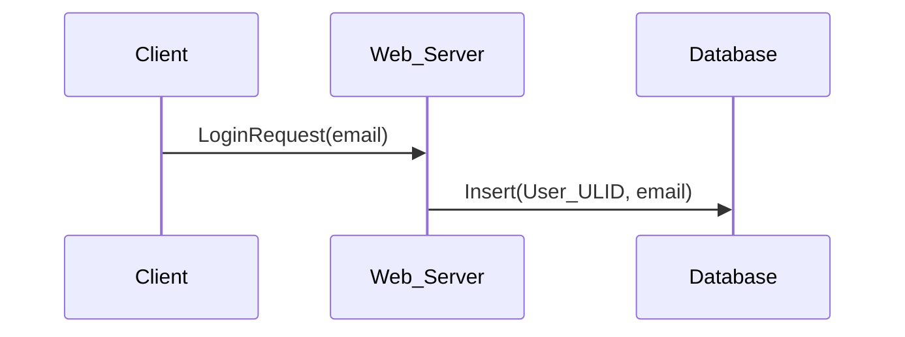
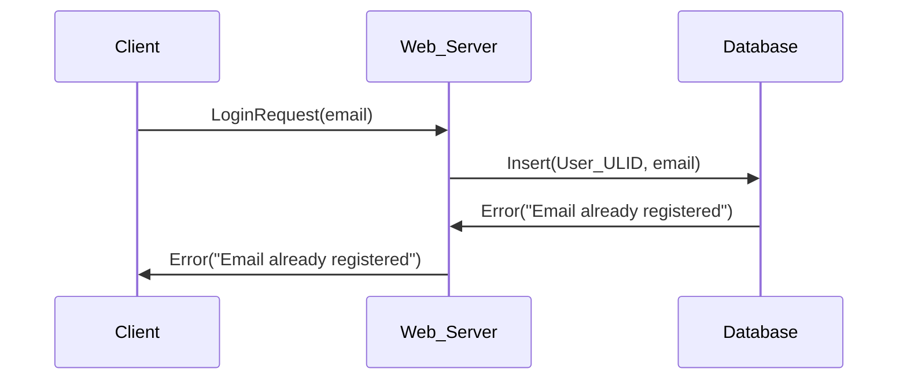
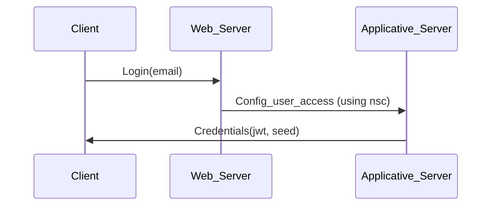
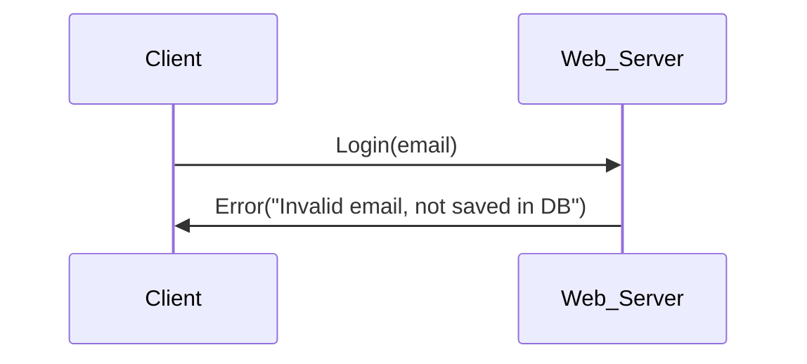
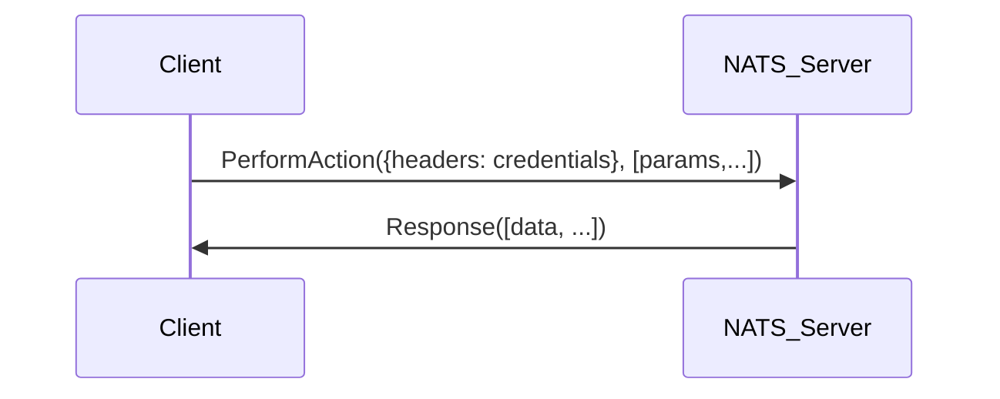
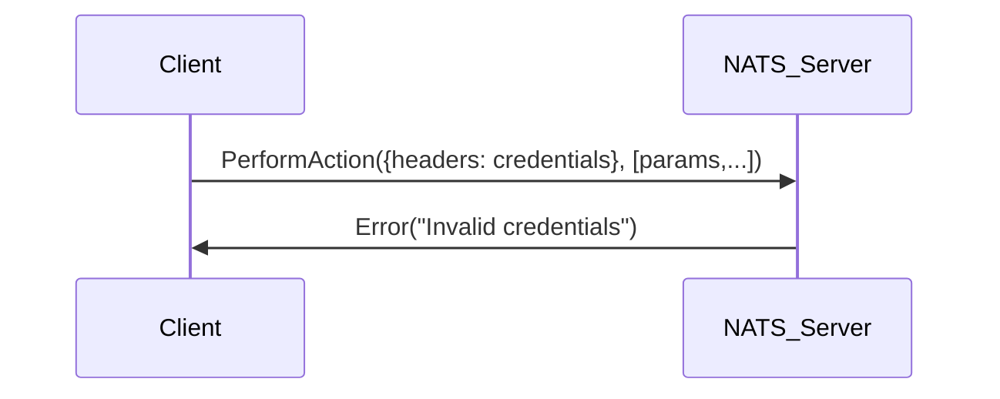
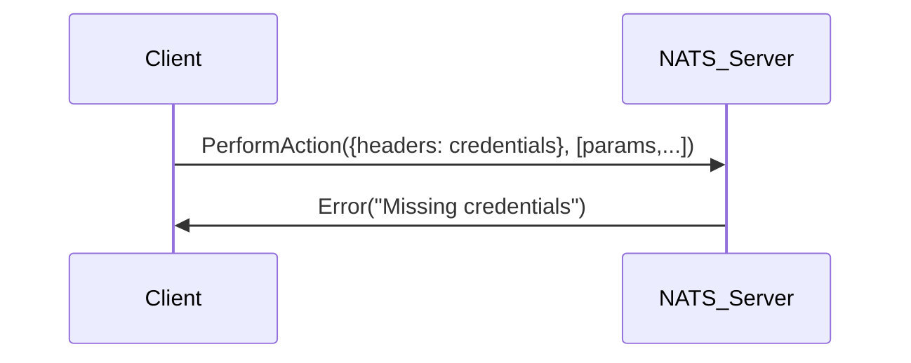
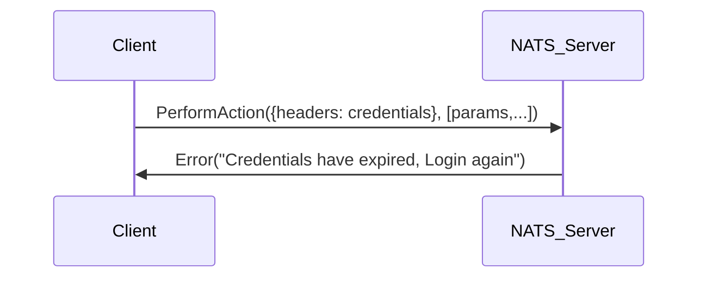

# First register

## Happy path

## Error handling

### Email already registered

# Obtaining a `JWT`

## Happy path

## Error handling

### Invalid email

# Making authenticated calls

## Happy path

## Error handling

### Invalid Credentials

### Missing Credentials

### No longer valid Credentials

