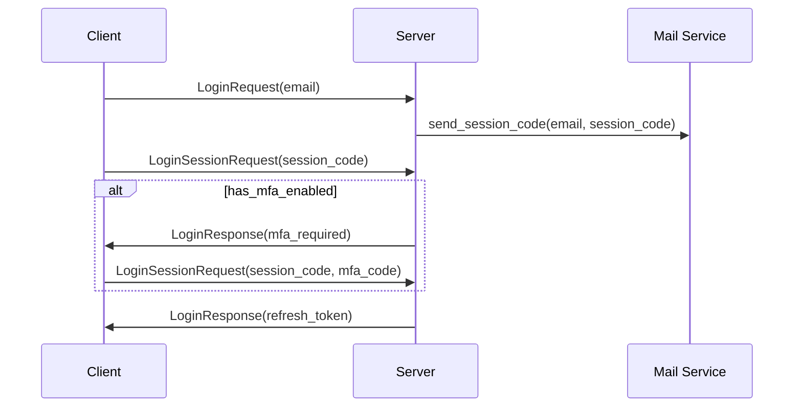
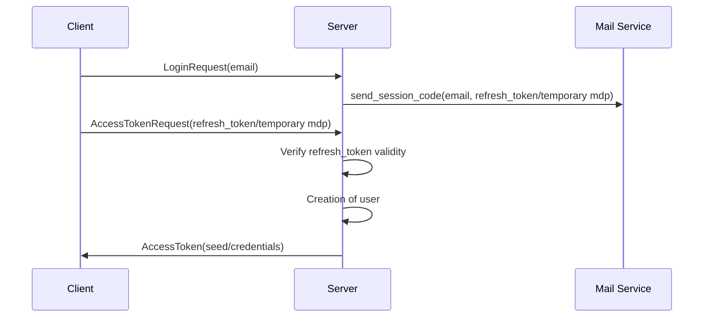
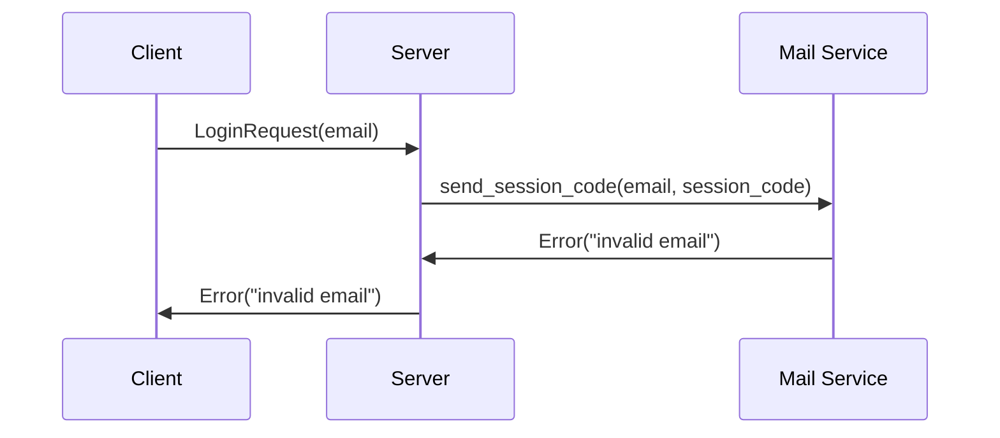
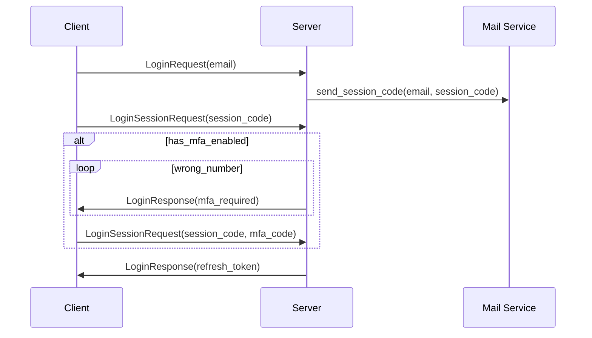
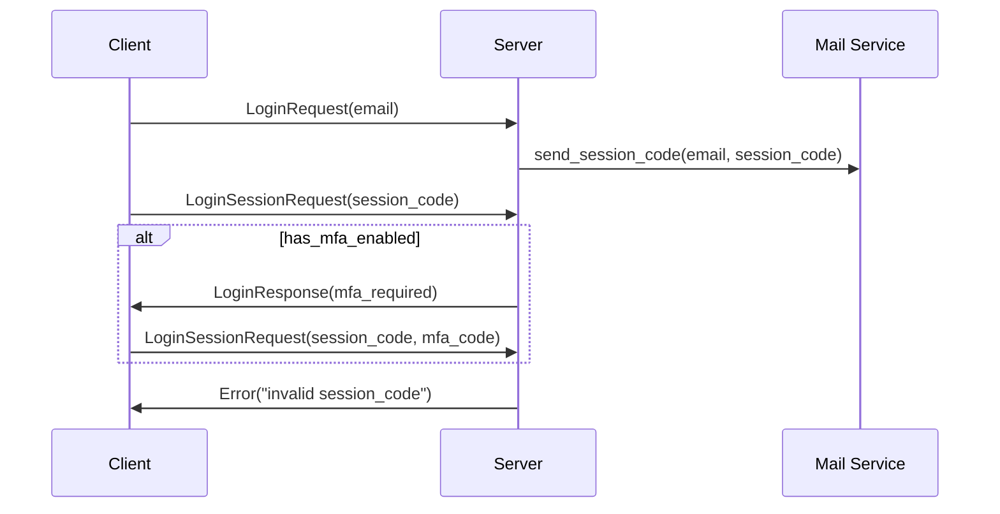
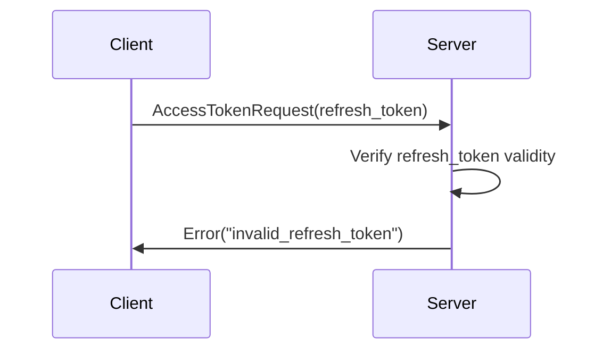
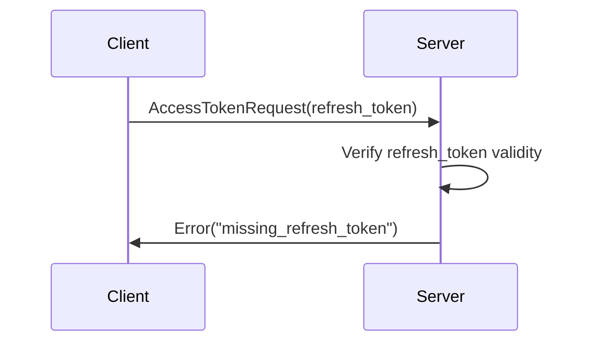
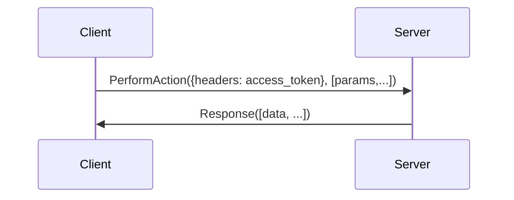
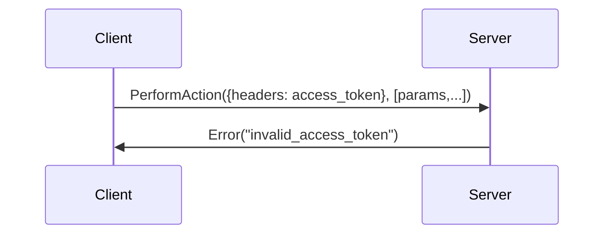
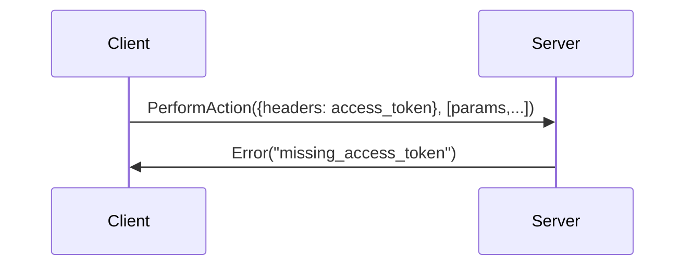

# Obtaining a `refresh_token`

## Happy path

## Error handling

### Invalid email

### MFA : wrong phone number

### Invalid session_code

# Obtaining an `access_token`

## Happy path

## Error handling

### Invalid refresh token

### Missing refresh token

# Making authenticated calls

## Happy path

## Error handling

### Invalid access token

### Missing access token

